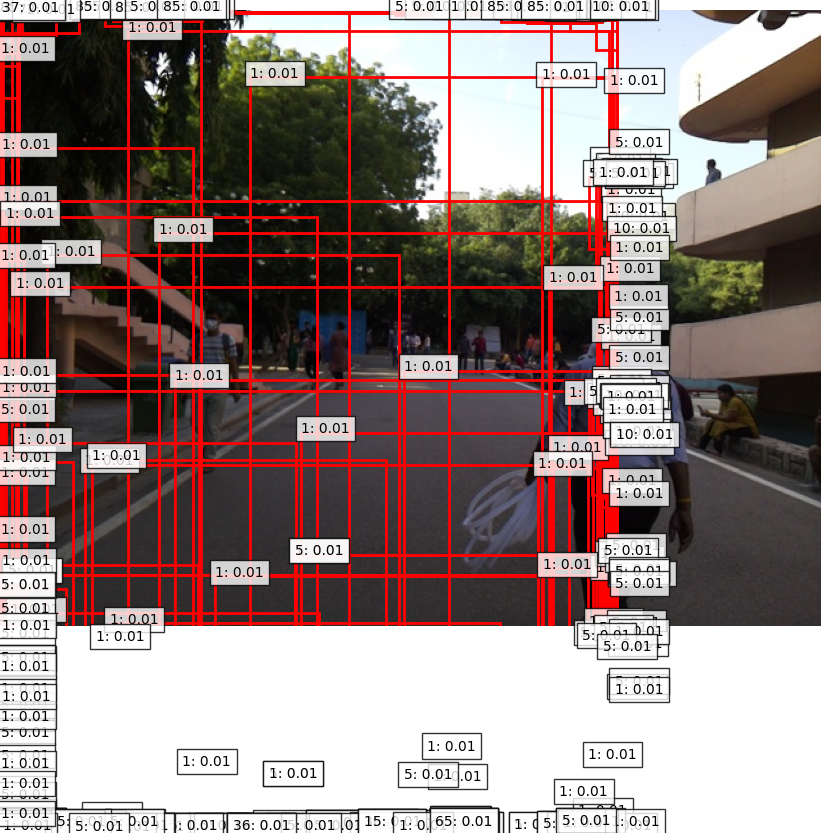
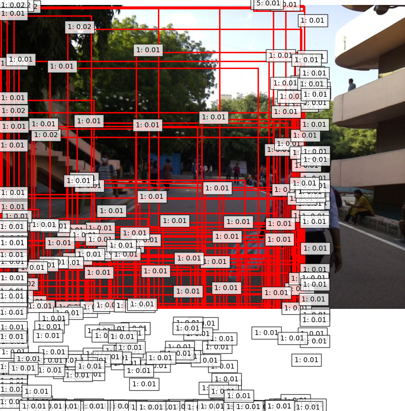
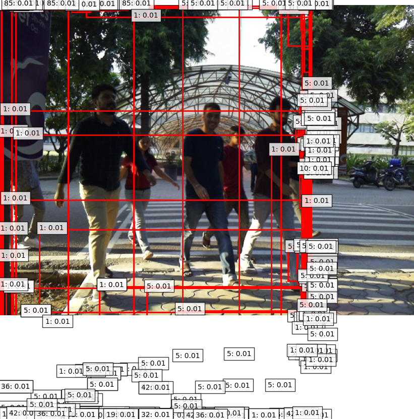
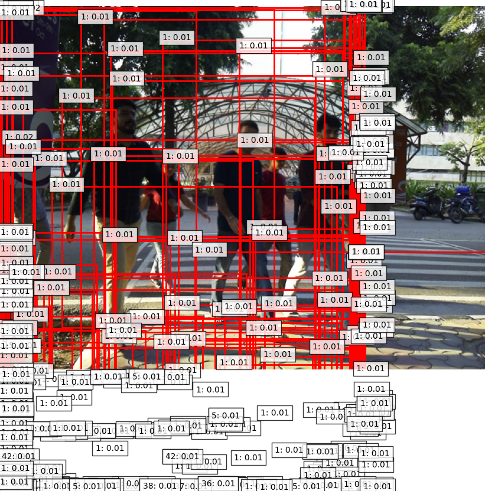
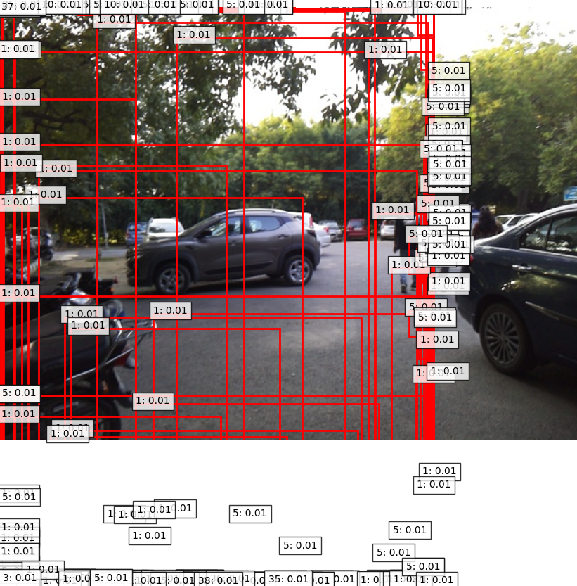
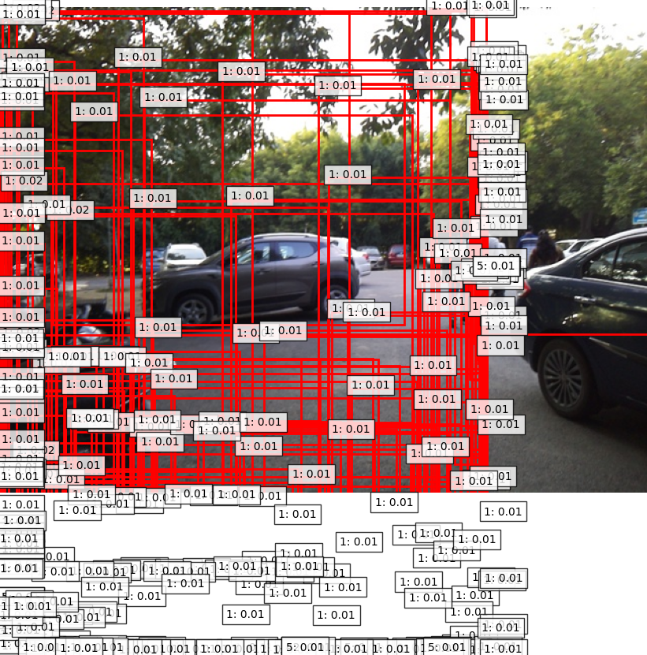
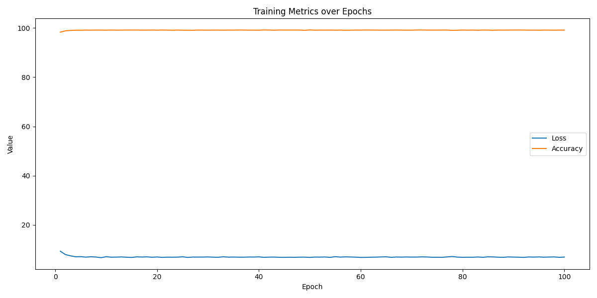

# Fine-tuning DINO for Object Detection on Custom Dataset

## Introduction

This project involves fine-tuning the pre-trained DINO-4scale object detection model with a ResNet-50 backbone on a custom dataset. The primary goal is to enhance the model's performance in detecting specific objects relevant to our task by adapting it to our dataset.

## Dataset Preparation

- **Dataset Split**:
  - **Training Set**: 160 images (`train/` directory)
  - **Validation Set**: 40 images (`val/` directory)
- Each image has an associated JSON file containing its annotations.
- Ensured that the annotations correctly correspond to the images in both the `train/` and `val/` directories.

## Implementation Details

### Code Modifications

- **Custom Data Loaders**: Modified data loading scripts to handle the custom dataset format.
- **Model Configuration**: Adjusted configuration files to accommodate the new dataset paths and hyperparameters.
- **Training Script**: Updated the training script to include fine-tuning parameters and checkpoint saving.
- **Evaluation Script**: Enhanced the evaluation script to output detection results and metrics in the desired formats.
- **Visualization Tools**: Implemented visualization utilities to compare detections from the pre-trained and fine-tuned models side by side.

All the modified code is available in the repository under the respective directories.

### Fine-tuning Parameters

- **Starting Point**: Began with the pre-trained DINO-4scale model.
- **Learning Rates**:
  - **Model**: `1e-5`
  - **Backbone**: `1e-6`
- **Epochs**: `100`
- **Batch Size**: `2`
- **Model Saving**: The fine-tuned model is saved as `final_model.pth`.

### Evaluation Process

- Evaluated both the pre-trained and fine-tuned models on the same validation set for a fair comparison.
- Metrics calculated using the COCO API.
- Detection results saved in COCO format (`detections.json`).
- Visualizations generated for selected validation images to compare model performance.

## Results

### Evaluation Metrics

#### Pre-trained DINO Model on Validation Set

```
AP @[ IoU=0.50:0.95 | area=   all | maxDets=100 ] = 0.000
AP @[ IoU=0.50      | area=   all | maxDets=100 ] = 0.000
AP @[ IoU=0.75      | area=   all | maxDets=100 ] = 0.000
AP @[ IoU=0.50:0.95 | area= small | maxDets=100 ] = 0.000
AP @[ IoU=0.50:0.95 | area=medium | maxDets=100 ] = 0.000
AP @[ IoU=0.50:0.95 | area= large | maxDets=100 ] = 0.000
AR @[ IoU=0.50:0.95 | area=   all | maxDets=  1 ] = 0.000
AR @[ IoU=0.50:0.95 | area=   all | maxDets= 10 ] = 0.000
AR @[ IoU=0.50:0.95 | area=   all | maxDets=100 ] = 0.000
AR @[ IoU=0.50:0.95 | area= small | maxDets=100 ] = 0.000
AR @[ IoU=0.50:0.95 | area=medium | maxDets=100 ] = 0.000
AR @[ IoU=0.50:0.95 | area= large | maxDets=100 ] = 0.000
```

#### Fine-tuned DINO Model on Validation Set

```
AP @[ IoU=0.50:0.95 | area=   all | maxDets=100 ] = 0.000
AP @[ IoU=0.50      | area=   all | maxDets=100 ] = 0.000
AP @[ IoU=0.75      | area=   all | maxDets=100 ] = 0.000
AP @[ IoU=0.50:0.95 | area= small | maxDets=100 ] = 0.000
AP @[ IoU=0.50:0.95 | area=medium | maxDets=100 ] = 0.000
AP @[ IoU=0.50:0.95 | area= large | maxDets=100 ] = 0.000
AR @[ IoU=0.50:0.95 | area=   all | maxDets=  1 ] = 0.000
AR @[ IoU=0.50:0.95 | area=   all | maxDets= 10 ] = 0.000
AR @[ IoU=0.50:0.95 | area=   all | maxDets=100 ] = 0.000
AR @[ IoU=0.50:0.95 | area= small | maxDets=100 ] = 0.000
AR @[ IoU=0.50:0.95 | area=medium | maxDets=100 ] = 0.000
AR @[ IoU=0.50:0.95 | area= large | maxDets=100 ] = 0.000
```


## Visual Comparisons

Below are side-by-side comparisons of detection results from the pre-trained DINO model and the fine-tuned model on selected validation images.

### Image 10

<table>
  <tr>
    <td align="center">Pre-trained DINO</td>
    <td align="center">Fine-tuned DINO</td>
  </tr>
  <tr>
    <td></td>
    <td></td>
  </tr>
</table>

### Image 121

<table>
  <tr>
    <td align="center">Pre-trained DINO</td>
    <td align="center">Fine-tuned DINO</td>
  </tr>
  <tr>
    <td></td>
    <td></td>
  </tr>
</table>

### Image 178

<table>
  <tr>
    <td align="center">Pre-trained DINO</td>
    <td align="center">Fine-tuned DINO</td>
  </tr>
  <tr>
    <td></td>
    <td></td>
  </tr>
</table>

**Note**: The images are the same in both cases to provide a direct comparison of the models' performance.

## Loss Graphs

The training loss over epochs during fine-tuning is visualized below:

<p align="center">
  
</p>

- The loss graph helps understand the model's learning progress.


## Conclusion

The project aimed to improve object detection performance by fine-tuning a pre-trained DINO model on a custom dataset. While the expected improvements were not realized, the exercise provided valuable insights into the challenges of training complex models on limited data. Future efforts will focus on overcoming these challenges to achieve better results.

## References

- **Pre-trained DINO Model Evaluation Results**:
  - [VDS_DINO Folder](https://drive.google.com/drive/folders/13Z37QaB94HJWei0RmGyd2QScfnEX0EvB?usp=sharing)
- **Fine-tuned DINO Model Evaluation Results**:
  - [VDS_DINO_FINE_TUNE Folder](https://drive.google.com/drive/folders/1iiVod5KgzvYPrkju4xnGcAQve3Wn3DW-?usp=sharing)
- **Fine-tuned Model Weights**:
  - [Final Model](https://drive.google.com/drive/folders/1VM61PEjacVm-vAdcY6niAPAIuC4lqXRv?usp=sharing)
- **Project Report**:
  - [Report](https://drive.google.com/drive/folders/1COk80AYLme-RtyNce-ZD9W3olrve8qUi?usp=sharing)

## Repository Contents

- **Modified Code**:
  - All custom and modified scripts are available in the repository.
  - Key scripts include:
    - `train.py`: Script for fine-tuning the model.
    - `evaluate.py`: Script for evaluating the model and generating metrics.
    - `data_loader.py`: Custom data loader for handling the dataset.
    - `visualization.py`: Tools for generating detection visualizations.
- **Results Directories**:
  - `VDS_DINO/`: Contains results from the pre-trained DINO model.
  - `VDS_DINO_FINE_TUNE/`: Contains results from the fine-tuned DINO model.
- **Images**:
  - Detection visualizations and loss graphs are included for reference.


